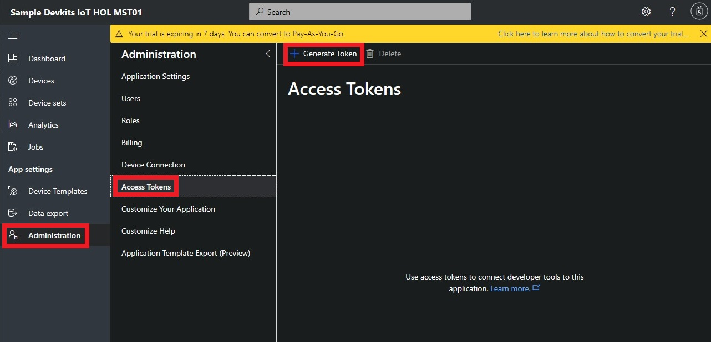
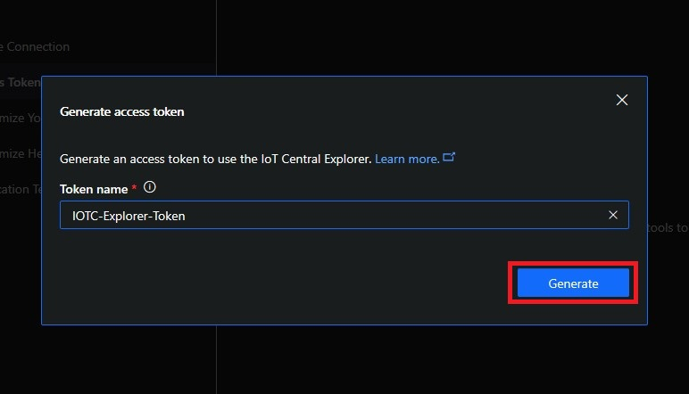

# Azure IoT Central and MXChip HOL
> NOTE: This HOL makes use of the IoT Central legacy application templates. It is archived and will no longer be maintained.

In this lab you can experience the simplicity of SaaS for IoT, with no cloud expertise required.
Azure IoT Central is a fully managed IoT SaaS (Software-as-a-Service) solution that makes it easy to connect, monitor and manage IoT assets at scale.
Using IoT Central gives you the following advantages:
- Simplify setting up your IoT solution
- Connect and manage your things with ease
- Built-in world-class security and privacy

More information about Azure IoT Central, including a getting started video,
can be found in the [Azure IoT Central documentation](https://docs.microsoft.com/en-us/previous-versions/azure/iot-central/core/overview-iot-central).
## Azure IoT Central Personas
In this workshop you will learn how to build, use and administer an IoT Central application through the perspective of each of the following personas:
1) Administrator
   - Create IoT Central applications
   - Administer IoT Central applications
1) Builder
   - Define new device types
   - Configure rules and actions
   - Customize the operator's view
1) Operator
   - Monitor devices
   - Add new device instances

## Creating an Azure IoT Central Application
This tutorial show you, as an administrator, how to create a new Azure IoT Central application. Navigate to the [Azure IoT Central application manager](https://aka.ms/iotcentral) website. Then sign in with a Microsoft personal, work, or school account.
To start creating a new Azure IoT Central application, select **New Application**. This link takes you to the **Create an application** page.


For the purpose of this workshop, use the following settings:
- Choose payment plan **Trial**
- Select an application template **Sample Devkits**
- Set an **Application name** e.g. *Sample Devkits IoT HOL 001*. This name has to be unique.
- Provide all mandatory contact information
- Click **Create** to create your new Azure IoT Central application

More details on how to create an Azure IoT Central application and the meaning of all different fields can be found [in this document](https://docs.microsoft.com/en-us/azure/iot-central/howto-create-application).

An application created from the **Sample Devkits** application template includes a **MXChip** device template that defines a large number of device characteristics, utilizing the sensors on the device. More details about the configuration can be found in the [MXChip Device template details](https://docs.microsoft.com/en-us/azure/iot-central/howto-connect-devkit#mxchip-device-template-details).


## Add a real device to your Azure IoT Central application
Follow [these step-by-step instructions](https://docs.microsoft.com/en-us/previous-versions/azure/iot-central/core/howto-connect-devkit#add-a-real-device) to add a physical device to your IoT Central application, to install the latest firmware on the MXChip DevKit, to setup WiFi and to connect the device securely to the IoT Central application.
Work to the entire instruction set to see the device's telemetry data and to control the device. Optionally you can also take a look at the device firmware, as described in [this part of the document](https://docs.microsoft.com/en-us/previous-versions/azure/iot-central/core/howto-connect-devkit#review-the-code).

## Use IOTC Explorer to monitor telemetry data
Use the IoT Central Explorer CLI to see messages your devices are sending to IoT Central and observe changes in the IoT Hub twin. You can use this open-source tool to gain deeper insight into the state of device connectivity and diagnose issues of device messages not reaching the cloud or devices not responding to twin changes.
### Prerequisites
- [Node.js version 8.x](https://nodejs.org) or higher
- An administrator of your application must generate an access token for you to use in iotc-explorer
### Install iotc-explorer
Run the following command from your command line to install:
``` bash
npm install -g iotc-explorer
```
### Run iotc-explorer
The following sections describe common commands and options that you can use when you run **iotc-explorer**. To view the full set of commands and options, run the following command from your command line:
``` bash
iotc-explorer --help
```
#### Login
Before you can do anything meaningfull with iotc-explorer, you need to have an adminstrator of your IoT Central application to get an access token for you to use. Take the following steps to generate the access token:
1) Navigate to **Administration** followed by **Access Tokens**
1) Select **Generate Token**



Enter a Token name, select **Next** and then **Copy**. On the next screen click on **Generate**.




> NOTE: The token value is only shown once, so it must be copied before closing the dialog. After closing the dialog, it is never shown again.

For this exercise, just copy the token to Notepad for later use.

Open a command prompt and login to iotc-explorer:


Notice the different commands you can give when calling iotc-explorer and at least make sure to monitor telemetry messages, received from your connected MXChip device.


This concludes the HOL on a physical MXChip device connected to an Azure IoT Central application. This is a great starting point for exploring more options of Azure IoT Central. To see what else is possible, please read the [Azure IoT Central Documentation and Quickstarts](https://docs.microsoft.com/en-us/previous-versions/azure/iot-central/core/overview-iot-central).

