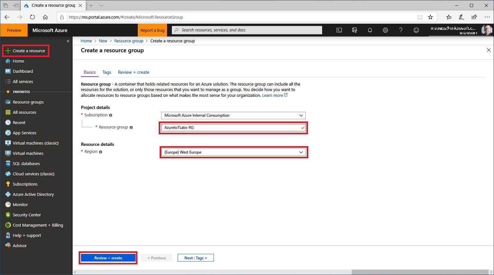
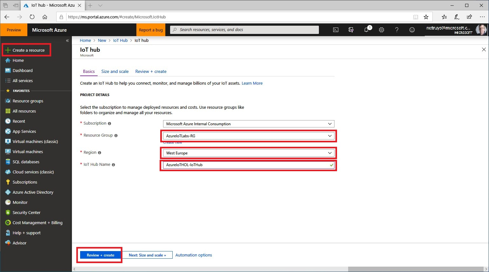

# Getting started with the MXCXhip IoT DevKit
## Introduction
This Hands-on-Lab (HOL) shows you how to get setup the [MXChip IoT DevKit](https://catalog.azureiotsolutions.com/details?title=MXChip-IoT-DevKit&source=home-page), how to connect it to an [Azure IoT Hub](https://docs.microsoft.com/en-us/azure/iot-hub/about-iot-hub) and how to send telemetry data from the device to the IoT Hub. The HOL is based on the following: [Introduction to Azure IoT Hub](https://github.com/Azure-Samples/azureiotlabs/blob/master/IoTHub/README.md). The reason to have this seperate description is that some users ran into issues using the original HOL, especially when referring to existing documentation to get the MXChip IoT DevKit connected to WiFi. In this HOL, some background information is left out, focussing mainly on the steps to take to get the MXChip IoT DevKit connected and ready to send telemetry data.
## Creating an IoT Hub
### Azure Resource Groups
[Azure Resource Groups](https://docs.microsoft.com/en-us/azure/azure-resource-manager/resource-group-overview#the-benefits-of-using-resource-manager) makes it very easy to work with all the resources in your solution as a group. You can deploy, update, or delete all the resources for your solution in a single, coordinated operation. Especially when running a Hands-on-Lab, you want to make sure that after finishing the HOL, you clean up all resources you were using for the HOL to make sure that you are not consuming (and thus paying for) Azure services you no longer need. All Azure resources, used in this HOL will be part of the same Azure Resource Group that can simply be deleted once you are done with the HOL.
### Creating an Azure Resource Group
Azure Resource Manager enables you to work with the resources in your solution as a group. You can deploy, update, or delete all the resources for your solution in a single, coordinated operation. There are several ways to create a resource group, for instance using the [Azure Portal](https://ms.portal.azure.com) or making use of [Azure Cloud Shell](https://azure.microsoft.com/en-us/features/cloud-shell/). For this HOL, we will make use of the Azure Portal. 

1) Navigate to the Azure Portal and login using your Azure subscription
1) Create a resource group to manage all your application resources for this HOL

Enter **Resource Group Name** and select a **Region**
### Creating an Azure IoT Hub
You will now create an IoT Hub to connect real devices or simulated devices and to be able to start sending (telemetry) data to Azure.

1) Create a new IoT Hub
1) Make sure that you use the resource group you created in the previous step
1) Make sure to select a region close to you
1) Keep all default settings in the **Size and scale** screen that will be displayed to you when you click the **review and create** button

## Preparing the MXChip
In this section we will prepare the MXChip to connect to the IoT Hub you just created. Prior to that, we also make sure that we have the right tools installed on your laptop.
### Prepare the development environment
To setup your development environment, use the [following instructions](https://docs.microsoft.com/en-us/azure/iot-hub/iot-hub-arduino-iot-devkit-az3166-get-started#prepare-the-development-environment) (steps 1 - 6).
### Install ST-Link drivers
In order to install communicate between the MXChip IoT DevKit, you need to install the right device drivers on your development machine by using the [following instructions](https://docs.microsoft.com/en-us/azure/iot-hub/iot-hub-arduino-iot-devkit-az3166-get-started#install-st-link-drivers).
## Building a MXChip project to send telemetry data to an IoT Hub
In this section you will load a sample project for the MXChip IoT DevKit. In order to do so, use the [following instructions](https://docs.microsoft.com/en-us/azure/iot-hub/iot-hub-arduino-iot-devkit-az3166-get-started#open-sample-code-from-sample-gallery) (steps 1 - 3). Make sure to select the **Get Started** sample. Since you are going to connect the MXChip to the IoT Hub you created earlier in this HOL, you need to provision the IoT Hub and the MXChip device. Use the [following steps](https://docs.microsoft.com/en-us/azure/iot-hub/iot-hub-arduino-iot-devkit-az3166-get-started#provision-azure-iot-hub-and-device) (steps 1 - 7) to provision both from within Visual Studio Code. Make sure to select the resource group you created earlier in this HOL in **step 3** and select the IoT Hub you created earlier in this HOL in **step 4**. In **step 6** create a new IoT Hub device to make the device known in the IoT Hub. Continue with the instructions to [Configure and compile the device code](https://docs.microsoft.com/en-us/azure/iot-hub/iot-hub-arduino-iot-devkit-az3166-get-started#configure-and-compile-device-code) (steps 1 - 4). Finally, use the following instructions to [test your project](https://docs.microsoft.com/en-us/azure/iot-hub/iot-hub-arduino-iot-devkit-az3166-get-started#test-the-project) (steps 1 - 5).
You now have successfully connected an MXChip IoT DevKit to your IoT hub, and you have sent the captured sensor data to your IoT hub.

